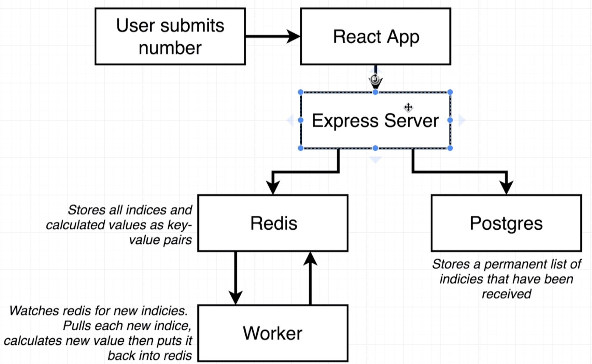

# Extreme-Fib-Calc

This is part of a Udemy course I am doing for Docker and K8s. This application is 100% overkill for a Fibonacci calculator, it is more to understand docker container interaction.

## Running Application

In order to run the Extreme-Fib-Calc the only thing you need is docker. When inside the project directory run the following command to start it up:

`docker compose up`

Once the server finishes booting up, go to [local host 3050](http://localhost:3050) to view the application.

## How Application Works

The diagram below shows how the diagram works:

